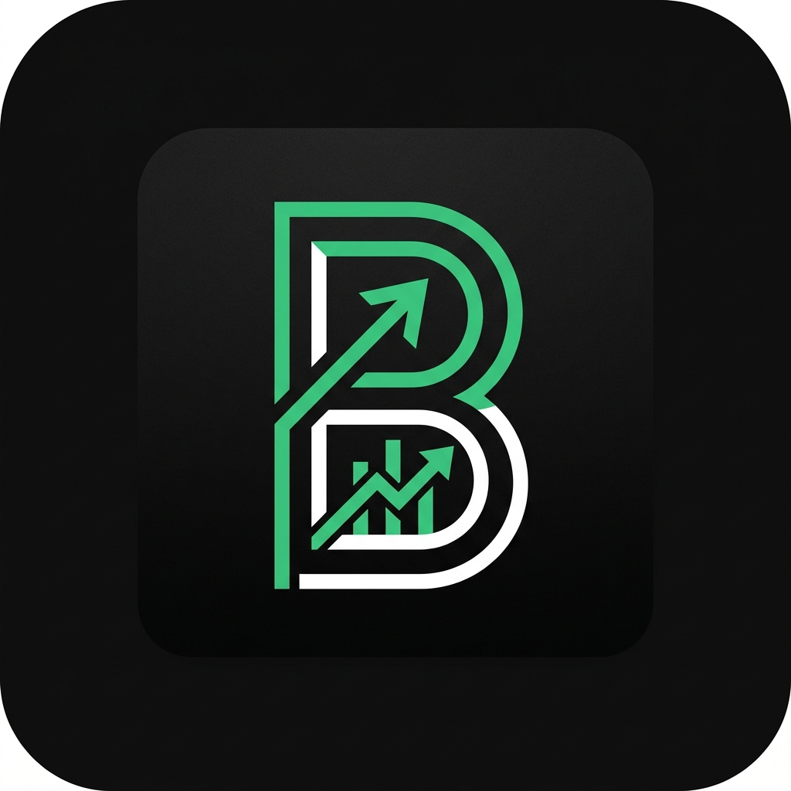

# B Tracker 🏦✨

A premium, modern finance tracking application built with React Native and Expo. B Tracker helps you manage your income and expenses across multiple currencies (AED/INR) with a stunning glassmorphism UI and secure cloud synchronization.



## 🚀 Key Features

- **Multi-Currency Support**: Track transactions in AED and INR simultaneously with separate balance cards.
- **Cloud Sync**: Securely backup and restore your data using Firebase Cloud Firestore.
- **Glassmorphism UI**: A premium, modern design with ambient backgrounds and smooth animations.
- **Secure Access**: Protect your financial data with a local PIN and Password.
- **Custom Categories**: Create and manage your own spending and earning categories.
- **Detailed Reports**: Visual summaries of your financial health.

## 📱 Getting Started

### Prerequisites
- [Node.js](https://nodejs.org/)
- [Expo Go](https://expo.dev/client) on your mobile device.

### Installation
1. **Clone the repository**:
   ```bash
   git clone https://github.com/rd-prathista/B-Tracker.git
   cd B-Tracker
   ```
2. **Install dependencies**:
   ```bash
   npm install
   ```
3. **Start the app**:
   ```bash
   npx expo start
   ```
4. Scan the QR code with your **Expo Go** app!

## ☁️ Cloud Sync Setup
This app uses Firebase for cloud backups.
1. Create a project on [Firebase Console](https://console.firebase.google.com/).
2. Enable **Firestore Database** and **Authentication** (Email/Password).
3. Update the `FIREBASE_API_KEY` and `PROJECT_ID` in `src/services/firebaseSyncService.js`.

## 🛠️ Built With
- **React Native** / **Expo**
- **SQLite** (Local Storage)
- **Firebase** (Cloud Sync)
- **Ionicons** (Icons)
- **Google Fonts (Inter)**

## 👤 Author
**Pranik Achary** - [@rd-prathista](https://github.com/rd-prathista)

---
*Built with ❤️ and Antigravity*
