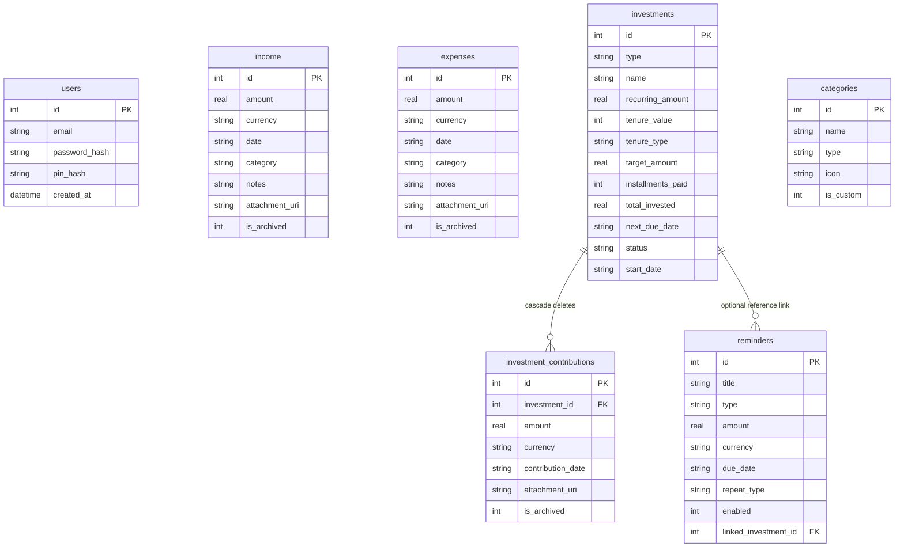

# B Tracker Database Schema

This document details the SQLite database tables, constraints, fields, indices, and relationships inside the local database `btracker.db` utilized by the application.

---

## 1. Table Definitions

### 1.1 `users`
Stores local credentials and password hashes for securing local sessions.
* **Fields**:
  * `id` (INTEGER PRIMARY KEY AUTOINCREMENT) - Unique identifier for the user.
  * `email` (TEXT) - Local email string.
  * `password_hash` (TEXT) - Hashed password for security.
  * `pin_hash` (TEXT) - Hashed passcode PIN for quick sign-in.
  * `created_at` (DATETIME DEFAULT CURRENT_TIMESTAMP) - Date/time registration took place.

---

### 1.2 `income`
Stores income transactions.
* **Fields**:
  * `id` (INTEGER PRIMARY KEY AUTOINCREMENT) - Unique identifier.
  * `amount` (REAL NOT NULL) - Decimal transaction value.
  * `currency` (TEXT NOT NULL DEFAULT 'AED') - UAE Dirham ('AED') or Indian Rupee ('INR').
  * `date` (TEXT NOT NULL) - ISO Date string.
  * `category` (TEXT NOT NULL) - Assigned category name.
  * `notes` (TEXT) - Optional details or details.
  * `attachment_uri` (TEXT) - Local URI file path of compressed picked receipt image.
  * `is_archived` (INTEGER DEFAULT 0) - `1` if archived, `0` if active.
  * `created_at` (DATETIME DEFAULT CURRENT_TIMESTAMP) - Creation date.

---

### 1.3 `expenses`
Stores expense transactions.
* **Fields**:
  * `id` (INTEGER PRIMARY KEY AUTOINCREMENT) - Unique identifier.
  * `amount` (REAL NOT NULL) - Decimal transaction value.
  * `currency` (TEXT NOT NULL DEFAULT 'AED') - Currency denomination.
  * `date` (TEXT NOT NULL) - ISO Date string.
  * `category` (TEXT NOT NULL) - Assigned category name.
  * `notes` (TEXT) - Details or context.
  * `attachment_uri` (TEXT) - Local URI file path of compressed receipt image.
  * `is_archived` (INTEGER DEFAULT 0) - `1` if archived, `0` if active.
  * `created_at` (DATETIME DEFAULT CURRENT_TIMESTAMP) - Creation date.

---

### 1.4 `investments` (Master Schemes)
Defines investment schemes and installments tracking logic.
* **Fields**:
  * `id` (INTEGER PRIMARY KEY AUTOINCREMENT) - Unique identifier.
  * `type` (TEXT NOT NULL) - Investment category (e.g. SIP, Gold, LIC, Crypto, etc.).
  * `name` (TEXT NOT NULL) - User-friendly label for the scheme.
  * `currency` (TEXT NOT NULL) - Assigned currency.
  * `recurring_amount` (REAL NOT NULL) - Periodic installment amount.
  * `tenure_value` (INTEGER NOT NULL) - Total tenure span quantity.
  * `tenure_type` (TEXT NOT NULL) - Tenure period metric ('Months' or 'Years').
  * `target_amount` (REAL) - Optional ultimate target value.
  * `installments_paid` (INTEGER DEFAULT 1) - Running tally of paid installments.
  * `total_invested` (REAL DEFAULT 0) - Total accumulated funds.
  * `next_due_date` (TEXT) - Target date of the next installment.
  * `status` (TEXT DEFAULT 'Active') - `'Active'` or `'Completed'` or `'Archived'`.
  * `start_date` (TEXT NOT NULL) - Initial setup date.
  * `notes` (TEXT) - Optional details.
  * `created_at` (DATETIME DEFAULT CURRENT_TIMESTAMP) - Log date.

---

### 1.5 `investment_contributions`
Stores detailed periodic payments made towards a specific master investment scheme.
* **Fields**:
  * `id` (INTEGER PRIMARY KEY AUTOINCREMENT) - Unique contribution identifier.
  * `investment_id` (INTEGER NOT NULL) - Foreign Key linked to `investments(id)` (ON DELETE CASCADE).
  * `amount` (REAL NOT NULL) - Payment contribution amount.
  * `currency` (TEXT NOT NULL) - Inherited currency.
  * `contribution_date` (TEXT NOT NULL) - Date contribution was added.
  * `notes` (TEXT) - Details or memo.
  * `attachment_uri` (TEXT) - Local URI path to compressed receipt image.
  * `is_archived` (INTEGER DEFAULT 0) - `1` if archived, `0` if active.
  * `created_at` (DATETIME DEFAULT CURRENT_TIMESTAMP) - Log timestamp.

---

### 1.6 `reminders`
Provides scheduling metadata for dashboard-only payment alarms.
* **Fields**:
  * `id` (INTEGER PRIMARY KEY AUTOINCREMENT) - Unique identifier.
  * `title` (TEXT NOT NULL) - Alarms description (e.g. "LIC Payment").
  * `type` (TEXT NOT NULL) - Category type (e.g. SIP, Rent, Bills).
  * `amount` (REAL) - Associated fee/cost.
  * `currency` (TEXT) - Target currency.
  * `due_date` (TEXT NOT NULL) - Planned schedule date.
  * `repeat_type` (TEXT NOT NULL DEFAULT 'One Time') - Frequency ('None', 'Daily', 'Weekly', 'Monthly', 'Yearly').
  * `enabled` (INTEGER DEFAULT 1) - `1` if enabled/active, `0` if muted/disabled.
  * `linked_investment_id` (INTEGER) - Optional links connecting a reminder directly to a master investment card.
  * `created_at` (DATETIME DEFAULT CURRENT_TIMESTAMP) - Alarms setup time.

---

### 1.7 `categories`
Defines categories for income, expenses, and investments.
* **Fields**:
  * `id` (INTEGER PRIMARY KEY AUTOINCREMENT) - Category identifier.
  * `name` (TEXT NOT NULL) - User-facing category title.
  * `type` (TEXT NOT NULL) - `'income'` or `'expense'` or `'investment'`.
  * `icon` (TEXT DEFAULT 'ellipse-outline') - Expo vector Ionicons icon name.
  * `is_custom` (INTEGER DEFAULT 0) - `1` if added by user, `0` if system default.

---

### 1.8 `app_settings`
Manages general configuration flags for the application.
* **Fields**:
  * `id` (INTEGER PRIMARY KEY AUTOINCREMENT) - Unique identifier.
  * `theme` (TEXT DEFAULT 'dark') - UI layout theme style.
  * `currency` (TEXT DEFAULT 'AED') - Global default currency.
  * `default_currency_mode` (TEXT DEFAULT 'AED') - Currency picker choice ('ask', 'AED', 'INR').
  * `biometrics_enabled` (INTEGER DEFAULT 0) - Biometric passcode unlock status (`1` or `0`).
  * `last_sync_time` (TEXT) - Last successful Firebase cloud synchronization timestamp.
  * `dev_cleared` (INTEGER DEFAULT 0) - `1` if developer one-off clean trigger ran, `0` if not.

---

## 2. Table Relationships Diagram

---

## 3. Database Indexes (Speed & Performance)

To maximize dashboard calculations, transaction listings, and reports queries, the following SQLite indices are declared:

1. **`idx_income_currency_date`**: Accelerates reports and dashboard cash flow computations.
   * `CREATE INDEX IF NOT EXISTS idx_income_currency_date ON income(currency, date);`
2. **`idx_income_is_archived`**: Accelerates active vs. archived dashboard rendering.
   * `CREATE INDEX IF NOT EXISTS idx_income_is_archived ON income(is_archived);`
3. **`idx_expenses_currency_date`**: Optimizes expense balance summary filters.
   * `CREATE INDEX IF NOT EXISTS idx_expenses_currency_date ON expenses(currency, date);`
4. **`idx_expenses_is_archived`**: Speeds up active vs. archived expense tracking.
   * `CREATE INDEX IF NOT EXISTS idx_expenses_is_archived ON expenses(is_archived);`
5. **`idx_investments_status`**: Optimizes card expansions and status toggles.
   * `CREATE INDEX IF NOT EXISTS idx_investments_status ON investments(status);`
6. **`idx_contributions_inv_id`**: Optimizes history listing for specific investments.
   * `CREATE INDEX IF NOT EXISTS idx_contributions_inv_id ON investment_contributions(investment_id);`
7. **`idx_contributions_is_archived`**: Speeds up active vs. archived contribution summaries.
   * `CREATE INDEX IF NOT EXISTS idx_contributions_is_archived ON investment_contributions(is_archived);`
8. **`idx_reminders_enabled`**: Accelerates dashboard reminder cards processing.
   * `CREATE INDEX IF NOT EXISTS idx_reminders_enabled ON reminders(enabled);`
9. **`idx_categories_type_name`**: Speeds up transaction category assignment lookups.
   * `CREATE INDEX IF NOT EXISTS idx_categories_type_name ON categories(type, name);`
