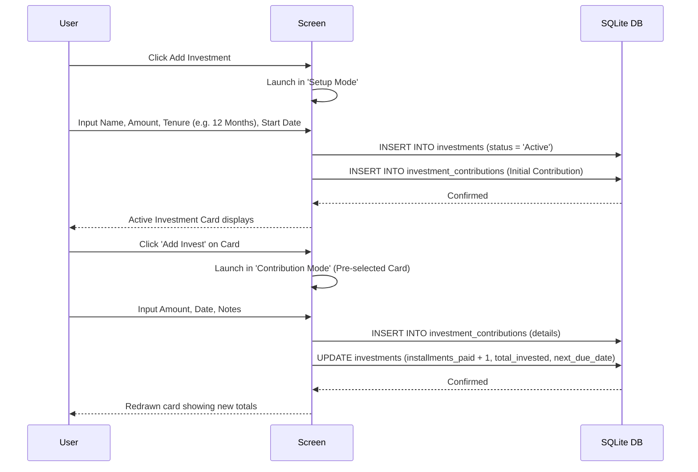
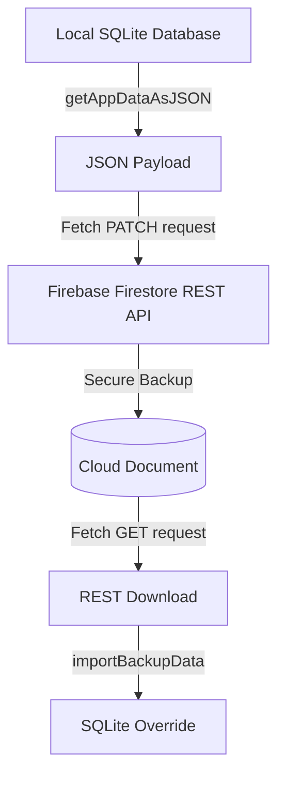

# B Tracker App Flow Walkthrough

This document outlines the core functional journeys, architecture behaviors, and interactive features inside **B Tracker**.

---

## 1. General Application Flow

### 1.1 Authentication & Security
* **Register**: Create a local account using your Email and Password. Registration sets up your unique account schema in the local SQLite table.
* **Passcode PIN Setup**: On first registration or via settings, you can configure a **4-digit Passcode PIN** for fast security verification.
* **Login**: Quick local passcode entry. Biometric fingerprint scan (via Android/iOS FaceID/TouchID APIs) is fully integrated and can be toggled in settings.

### 1.2 Dashboard Workspace
* **Balances Cards**: Clear side-by-side active cash balance summaries showing UAE Dirham (AED) and Indian Rupee (INR) totals.
* **Cash Flow Breakdown**: Displays totals of your Income vs. Expenses, calculated dynamically in real-time from active, non-archived transaction tables.
* **Quick Navigation Tab Bar**: Seamless access to the Dashboard, reports charts, investments list, reminders hub, and system settings.

---

## 2. Investment Management Flow

B Tracker features a dual-mode Investment manager tracking master schemes and periodic payments.

### 2.1 Creation ("Setup Mode")
* Opens the `AddTransaction` page in `'setup'` mode.
* Asks you to define the scheme name, currency, monthly recurring amount, tenure value (e.g., 2 Years or 12 Months), and startup date.
* Saves the master card as `'Active'` in the database and automatically writes the `'Initial Contribution'` into your contributions history.

### 2.2 Contributions ("Contribution Mode")
* Click **Add Invest** inside an active investment card.
* Opens the `AddTransaction` page in `'contribution'` mode with the specific scheme pre-selected and locked.
* Only asks for the contribution **Amount**, **Date**, and **Notes**.
* Saving updates the scheme's installment count, adds to the total invested pool, and recalculates the **Next Due Date** according to the tenure type.
* **Auto-completion**: Once the total paid installments reach the tenure target, the card's status automatically transitions to `'Completed'`.

---

## 3. Reminder Alarm Flow

Designed as a **dashboard-only reminders hub**, this system avoids background service bloat and notifications alert prompt popups.

* **Creating Reminders**: User sets a description title, category type (e.g., SIP, Rent, Utility Bills), amount, denomination, target due date, and recurrence type ('None', 'Daily', 'Weekly', 'Monthly', 'Yearly').
* **Dashboard Indicators**: Active, upcoming reminders matching the current week/month automatically highlight on the dashboard feed as friendly checklist items.
* **Toggles & Deletions**: User can temporarily silence reminders (flipping `enabled = 0` via the toggle button) or delete them permanently.
* **Linked Investments**: Reminders can be linked to active investment schemes so that contributing to the investment updates the reminder due date automatically.

---

## 4. Active & Archived Data Flow

To keep lists clean and fast, B Tracker features an archive mode that separates current entries from historical records.

* **Archiving Criteria**: Data older than a specified period (e.g., 6 months) can be processed into the Archive.
* **Manual Toggles**: Clicking the outline **Archive** icon on any transaction details page immediately moves the entry into the background pool.
* **View Archived Tab**: Available in the Reports panel. Toggle **View Archived** to switch from active cash balances to historical calculations.
* **Clear All Data**: Red button that wipes all transaction, contribution, and goal entries in the dev environment for full end-to-end testing, while securely keeping login profiles and category structures untouched.

---

## 5. Attachment Handling (Local Storage Optimized)

To prevent long-term usage from overwhelming your phone's memory, B Tracker utilizes a localized compression pipeline:

1. **Pick & Crop**: Open image picker library with `allowsEditing: true` enabling easy cropping of receipts.
2. **Compress**: Set `quality: 0.5` which compresses JPEG images by up to **70%** without sacrificing legibility.
3. **Local Store**: Copies the processed asset into a dedicated app storage folder: `${documentDirectory}attachments/`.
4. **Clean Deletes**: Deleting a transaction automatically triggers an file system sweep, removing the physical local image file to ensure no ghost files occupy your device storage.

---

## 6. Firebase Cloud Sync Behavior

Syncing relies on a lightweight REST architecture, completely avoiding heavy Firebase SDK packages and Google OAuth complexity.

* **Authentication**: Uses email and password authentication directly via Google Identity Toolkit REST endpoints, securing custom user backup buckets.
* **Backup to Cloud**: Converts all SQLite tables into a compact JSON payload and patches it to Firestore under `/backups/{userId}`.
* **Restore from Cloud**: Fetches your remote JSON backup, wipes the local SQLite database, and replaces it with the backup content in a single atomic transaction.
